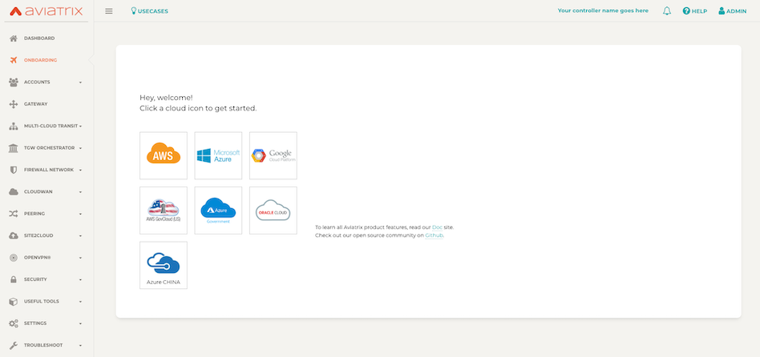

# Step 2 - Launch Aviatrix on Azure

This example will provision an Aviatrix Controller in Azure with terraform. Additionally it will check for and accept Azure Marketplace terms.

## Dependencies

You have boostrapped your environment in **Step 1**.

* terraform .12
* python 3
* azure subscription

## Instructions

1. Nothing needs to be modified. _(Optional)_ Modify variables.tf or create a terraform.tfvars if you want to change the Resource Group name, Region (East US), or tags. 

2. ```terraform init```

3. ```terraform plan```

4. ```terraform apply --auto-approve``` 

5. Open a browser to ***https://public_ip_address*** in terraform output
   
    
    ```
    Apply complete! Resources: 10 added, 0 changed, 0 destroyed.

    Outputs:

    aviatrix_controller_private_ip = 10.0.0.4
    public_ip_address = 52.144.47.189
    ```


6. Login with admin using ***private_ip_address*** as initial password, enter an email for notifications on the next screen, and enter a new password... 


Click the Run button, the latest software will be applied (approx 5 min)


Login with your password. Congratulations! Your Aviatrix Controller is ready!



## Now proceed to Step 3 to onboard the Azure Access Account

##### _Note_

Ignore the following warnings during ```terraform init``` they are coming from imported Azure modules from terraform registry.

```
Warning: "address_prefix": [DEPRECATED] Use the `address_prefixes` property instead.

  on .terraform/modules/vnet/terraform-azurerm-vnet-2.0.0/main.tf line 15, in resource "azurerm_subnet" "subnet":
  15: resource "azurerm_subnet" "subnet" {


Warning: Quoted references are deprecated

  on .terraform/modules/vnet/terraform-azurerm-vnet-2.0.0/main.tf line 29, in data "azurerm_subnet" "import":
  29:   depends_on = ["azurerm_subnet.subnet"]
```


