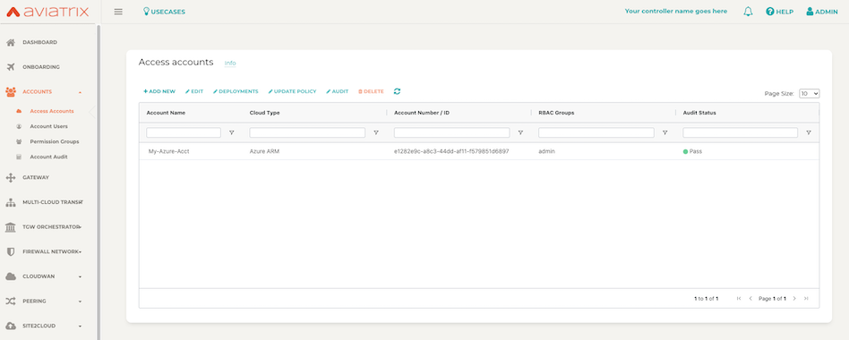

# Step 3 - Create Azure Access Account

This example will provision an Aviatrix Controller in Azure with terraform. Additionally it will check for and accept Azure Marketplace terms.

## Dependencies

You have provisioned Aviatrix Controller in **Step 2**, and have environment variables set from **Step 1**.

## Instructions

1. Open ```terraform.tfvars.example``` and replace controller_ip and password with your own, and **save the file as** ```terraform.tvars```

2. ```terraform init```

3. ```terraform plan```

4. ```terraform apply --auto-approve``` 

5. Observe the account **My-Azure-Acct** in your Aviatrix Controller. You're ready to go!



Check out Aviatrix [docs](https://docs.aviatrix.com/) to work through some use cases!

